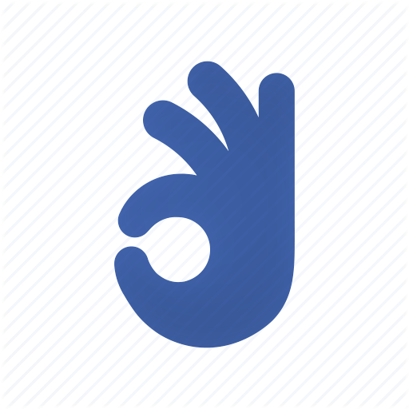
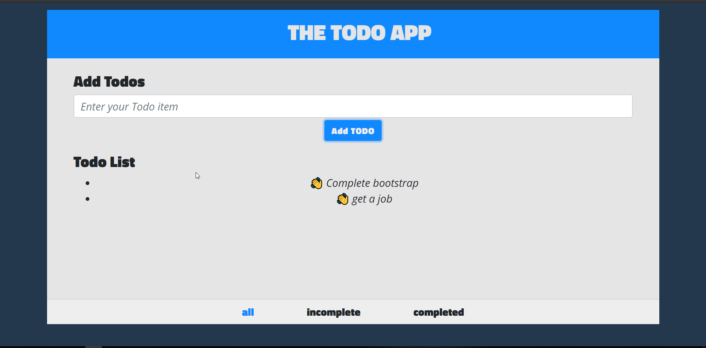

# The Todo App

  

<h6 align="center"> A Todo app where you write Things to do and mark as complete once you complete it. </h6>

The Todo App is a Web app which is built with React and Redux. 

## Goals
The main goals of this project were 
  * To learn about React and Redux
  * To learn bootstrap and design 

## Contributors
* [SushilBajracharya01](https://github.com/SushilBajracharya01)

## Trainers
* [Ujjwal Acharya](https://github.com/ujjalacharya)
* [James Subedi](https://github.com/subedijames2017)
* And the Team

## Demo
👉 live demo: <a href="https://sushilbajracharya01.github.io/the-todo-app/" target="_blank" >here</a>

## Features

- [x] Add Todo
- [x] Mark as Complete
- [X] nice UI
- [x] responsive design

## Built with
- [ReactJs](https://reactjs.org/)
- [Redux](https://redux.js.org/)
- [Bootstrap](https://getbootstrap.com/)

## License

MIT  © 
